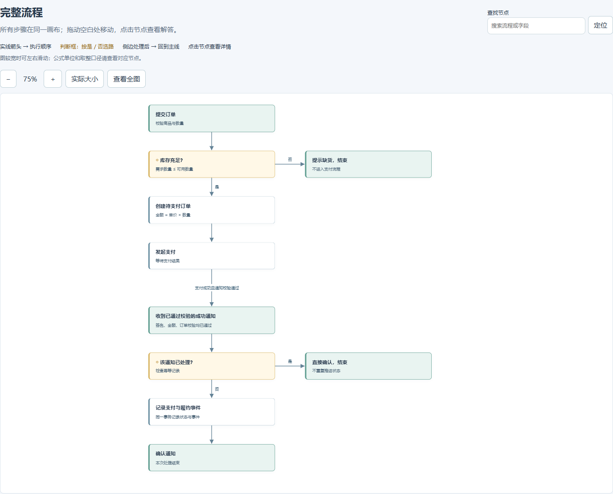
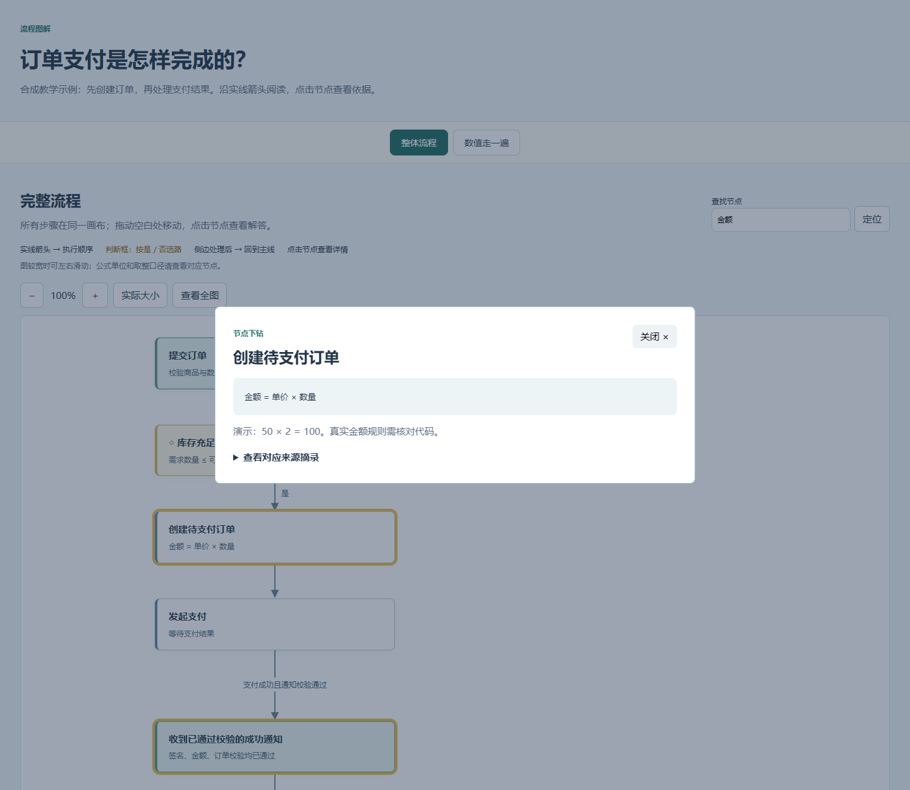

# Project Handbook

**让 Codex 安装并调用本 skill，提供代码、文档目录和一个问题，等待一份解答问题的 HTML。**

不需要先知道函数名。整条流程在一张可缩放、拖动的画布中呈现；遇到疑问，点击具体节点查看解释、公式、例子和依据。

## 快速上手

先把下面这句话发到 Codex 会话里，让 Codex 安装：

```text
帮我安装下这个 skill：
https://github.com/GXGXX/project-handbook/tree/main/project-handbook
```

安装好后，调用 skill，提供目录，直接问问题就行。例如：

```text
使用 $project-handbook。

这是客户端目录：D:/demo/client
这是服务端目录：D:/demo/server
这是文档目录：D:/demo/docs

目前游戏中的伤害流程是怎样的？
```

把示例目录换成自己的即可，也可以分几条消息提供目录和问题。

接下来等待 Codex 读取资料、梳理流程并输出 HTML。打开后先看完整流程，有疑问再点击具体节点查看细节。

暂时没有某个目录也可以使用。安装后若未显示该 skill，重启 Codex。

## 输出是什么样的

下面是“订单支付”教学示例生成的真实页面截图，使用合成数据。



- **查看全图**：一次看到整个流程及连线。
- **缩放与拖动**：放大看局部，拖动空白处移动画布。
- **查找并定位**：输入节点名称或字段，定位到对应步骤。
- **点击节点**：查看该步骤做什么、为什么、依据是什么。
- **数值走一遍**：跟着具体输入，看每一步如何得到最终结果。



HTML 可直接在浏览器中打开，不需要启动服务。

## 继续提问

在 Codex 中继续提出问题，由 Codex 核对代码并更新对应节点：

```text
我没看懂重复通知为什么不会重复发货，请在对应节点补充例子。
把支付失败和取消支付的路径补进这张图。
金额计算太笼统，请核对优惠券和取整规则后展开说明。
```

Codex 读取补充材料并更新 HTML 后，仍可在同一张图上理解完整过程。
