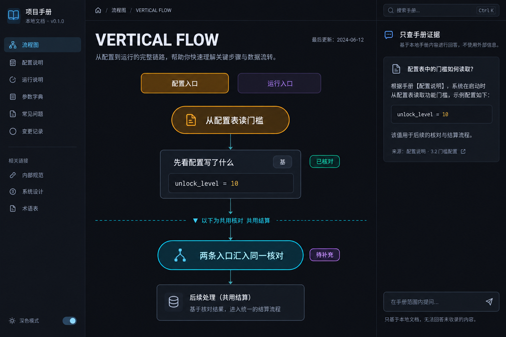
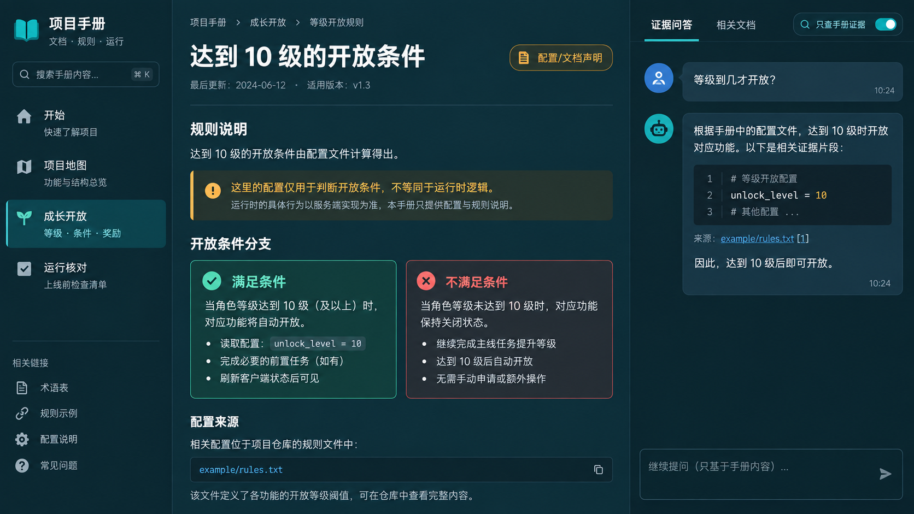
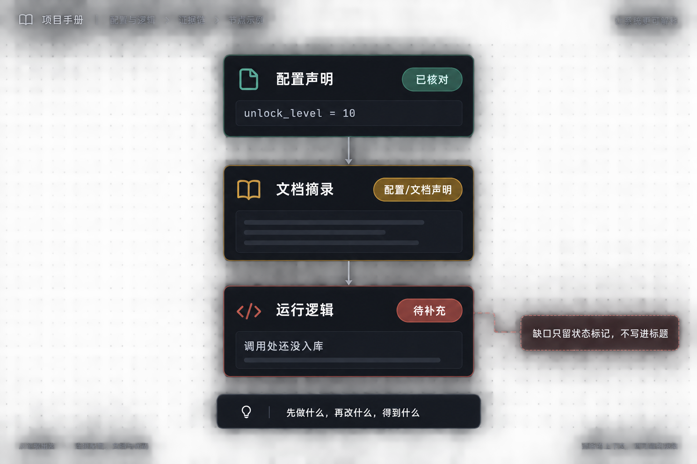

# Project Handbook

把代码库和文档整理成一套可核验、可离线打开的项目手册。默认交付是：

**一个读者问题 → 一张可核对的竖向流程图 → 右侧只查手册证据。**

它受到 [`aicoding-cookbook`](https://github.com/lili-luo/aicoding-cookbook) 中
`docs-to-book` 思路启发，但脚本和模板在此仓库中独立实现。

## 先看长什么样

首页是竖向流程图，不是整本百科。多条入口用顶部按钮切换，下面会合到共用核对。右侧默认只返回手册摘录，不调用模型。



点进专题后，左导航、中间正文、右侧问答并排。问答必须带上来源，例如 `unlock_level = 10` 和 `[1]`。



节点标题只写「先做什么、再改什么、得到什么」。缺证据时只打状态标记，不把「未入库」写进标题。



配图是界面示意，帮助理解阅读路径。仓库里可运行的是不含真实项目数据的合成示例。

## 0.9 这次优化了什么

- 默认产出从整本项目百科改成「一问一图」。
- 首页用可切换车道 + 共用段；系统地图留在项目地图页。
- 主阅读栏加宽，公式行不折成竖排；共用段有分隔线和描边舞台。
- 并列分支并排渲染，不编造额外拓扑。
- 问答默认本地证据摘录；选择模型问答并发送时，会将问题与检索片段发给所选供应商，无须重复勾选。
- 渲染器拒绝覆盖已有输出目录，更新内容时写到新的 sibling 目录。

## 快速开始

先用不含真实项目数据的示例走通：

```text
python project-handbook/scripts/build_knowledge.py project-handbook/assets/knowledge.example.json ./sample-atlas
python project-handbook/scripts/verify_handbook.py ./sample-atlas
python project-handbook/scripts/chat_server.py ./sample-atlas --evidence-only
```

打开 `http://127.0.0.1:8765/`。语义内容由作者读证据后写入 `knowledge.json`，不是扫描文件便自动推导全项目。Schema 见 [图解指南](project-handbook/references/knowledge.md)。

`--evidence-only` 不读取环境变量中的模型凭据；它不是断网开关。用户在页面主动填写供应商地址和密钥、选择模型问答后，仍可发起模型请求。

### 原有普通手册模式

```text
python project-handbook/scripts/init_handbook.py ./my-handbook
python project-handbook/scripts/build_handbook.py ./my-handbook
python project-handbook/scripts/verify_handbook.py ./my-handbook
```

如果代码和文档是两个目录，可以只读导入一轮素材，并只写入新输出目录：

```powershell
python project-handbook/scripts/import_project.py `
  --client D:\path\to\client `
  --backend D:\path\to\backend `
  --docs D:\path\to\docs `
  --output .\my-handbook
```

`--backend` 可省略；省略时，生成的项目地图会把服务端校验标成“待补充”，不会从客户端目录推断运行结论。

要实际询问模型，不要把密钥写进配置或 HTML：

```powershell
$env:OPENAI_API_KEY = "粘贴你的密钥"
$env:OPENAI_MODEL = "gpt-4o-mini"
python project-handbook/scripts/chat_server.py .\my-handbook
```

然后打开终端输出的 `http://127.0.0.1:8765/`。完整边界见
[references/chat.md](project-handbook/references/chat.md)。

## 目录

```text
project-handbook/
├── SKILL.md
├── agents/openai.yaml
├── scripts/
│   ├── init_handbook.py
│   ├── import_project.py
│   ├── build_knowledge.py
│   ├── build_handbook.py
│   ├── verify_handbook.py
│   └── chat_server.py
├── references/
│   ├── knowledge.md
│   ├── authoring.md
│   ├── chat.md
│   ├── audit-checklist.md
│   └── validation.md
└── assets/
    ├── knowledge.example.json
    ├── book.example.json
    ├── style.css
    ├── atlas.js
    ├── app.js
    └── chat.js
```

## 设计边界

静态 verifier 能证明结构、链接、资产、锚点和证据 token 的一致性，不能证明
一条业务陈述真的正确。缺服务端源码时，内层公式保持「待补充」，不把后整理图
当成现网事实。真实项目素材应留在仓库外的私有目录。

## 作品集叙事

这个项目可以按“观察—假设—实验—证据”来展示：先指出原方案在严格失败、
`file://` 搜索、HTML 安全和事实核验上的落差；再说明为什么选择标准库、
预检构建、facts manifest、一问一图和本地 relay；最后用回归测试、跨 Python
版本 CI 和可重打包的 zip 证明改动不是只停留在 prompt 层面。

脱敏后的本机演练记录见 [TEST_REPORT.md](TEST_REPORT.md)。

## 许可证与致谢

本项目是独立实现的个人作品集项目。原始灵感来自上面的公开仓库；原仓库
当前没有在根目录提供通用许可证，因此本项目不复制其实现代码，并保留来源
链接以便读者比较设计取舍。
