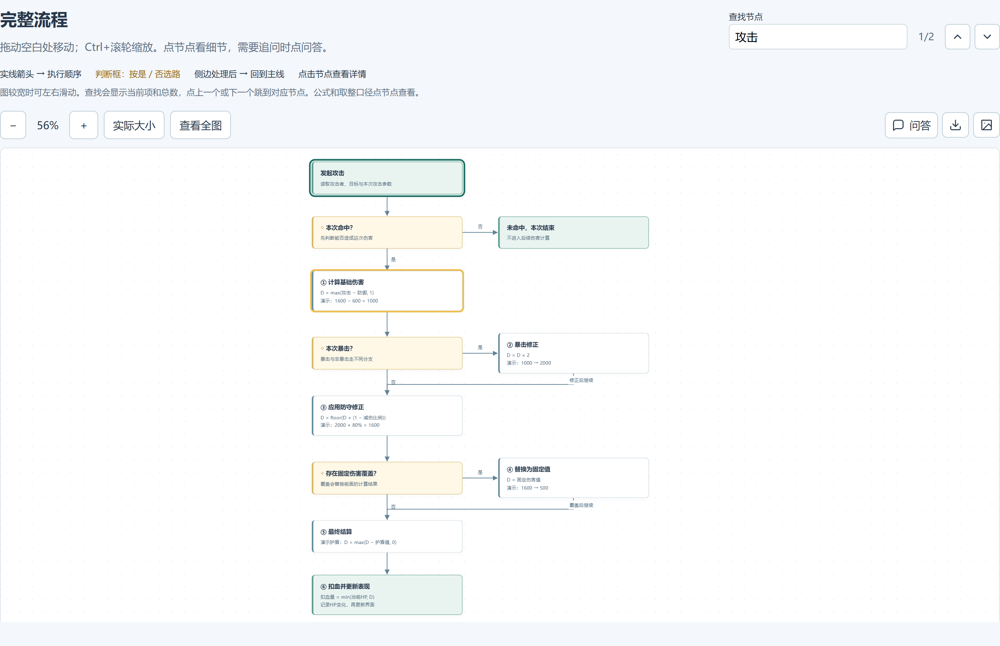
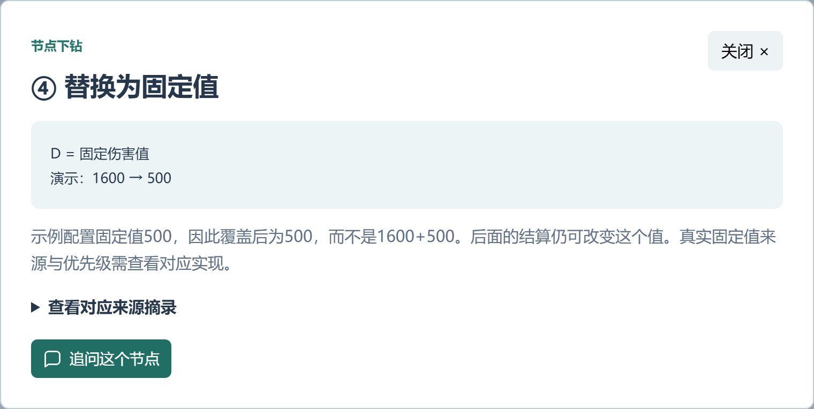
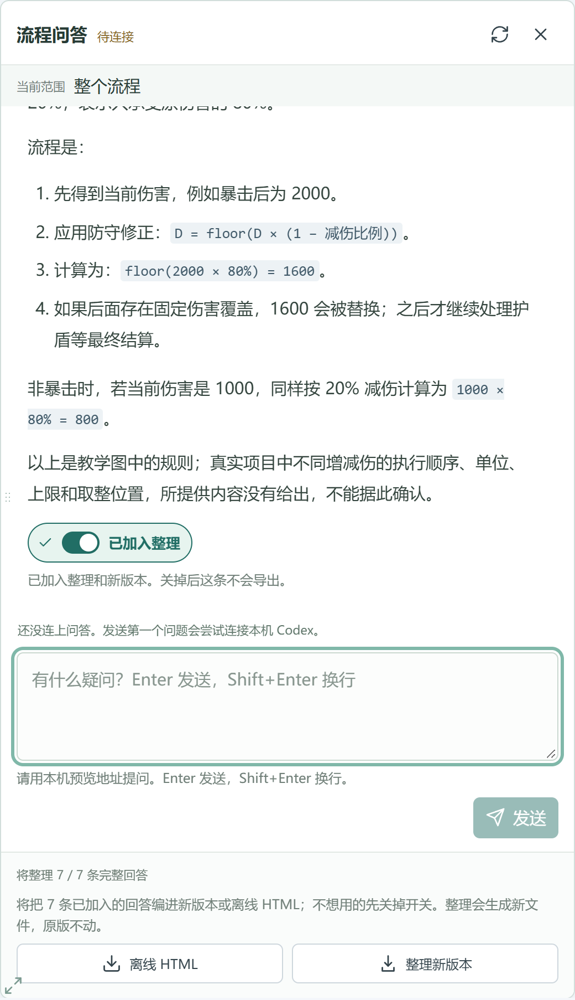

# Project Handbook

**让 Codex 安装并调用本 skill，提供代码、文档目录和一个问题，等待一份解答问题的 HTML。**

不需要先知道函数名。整条流程在一张可缩放、拖动的画布中呈现；遇到疑问，点击具体节点查看解释、公式、例子和依据。

## 快速上手

先把下面这句话发到 Codex 会话里，让 Codex 安装：

```text
帮我安装下这个 skill：
https://github.com/GXGXX/project-handbook/tree/main/project-handbook
```

安装好后，调用 skill，提供目录，直接问问题就行。例如：

```text
使用 $project-handbook。

这是客户端目录：D:/demo/client
这是服务端目录：D:/demo/server
这是文档目录：D:/demo/docs

目前游戏中的伤害流程是怎样的？
```

把示例目录换成自己的即可，也可以分几条消息提供目录和问题。

接下来等待 Codex 读取资料、梳理流程并输出 HTML。Codex 会同时打开本机阅读地址；先看完整流程，有疑问再点击具体节点查看细节或直接追问。

暂时没有某个目录也可以使用。安装后若未显示该 skill，重启 Codex。

## 输出是什么样的

下面是“游戏中的伤害流程”脱敏示例生成的真实页面截图。项目名称、代码路径、字段和业务数值均未公开，公式与数值已替换为教学数据。



- **查看全图**：一次看到整个流程及连线。
- **缩放与拖动**：按住 Ctrl 滚动鼠标滚轮，放大或缩小鼠标所在位置；拖动空白处移动画布。
- **搜索跳转**：输入节点名称或字段，查看当前项和总数，点击上一个或下一个箭头跳转到对应步骤。
- **点击节点**：查看该步骤做什么、为什么、依据是什么。
- **数值走一遍**：跟着具体输入，看每一步如何得到最终结果。



下载的 HTML 可以离线阅读；网页内继续追问时，使用 Codex 提供的本机阅读地址，不要用下载后的本地文件提问。

## 继续提问

点击节点里的 **追问这个节点**，在页面右侧直接提问，不用返回 Codex。例如：

```text
为什么固定伤害是覆盖前面的结果，而不是再加一次？
护盾是在减伤之前还是之后扣？用一个数字例子说明。
如果剩余血量只有 200，最终伤害和实际扣血分别是多少？
```

回答会逐步显示，问答记录会保存在本机。已有分析不足时，会在你提供的目录内只读检索相关片段；查不到会说明，不会把猜测当成结论。追问不会重新生成整张图。

按 **Enter** 发送，**Shift+Enter** 换行。拖动问答窗口左侧或左下角可调整大小；手机上可拖动顶部调整高度。自己的提问和 **Codex · AI** 的回答分开显示，公式、列表和代码会按格式排版。

发送后输入框立即清空，可以继续写下一条问题。回答失败时，原因和下一步会写在这条问答里，点击 **重试这条提问** 即可；连接暂时中断时会自动检查恢复，不会自动重复提问。



网页问答使用本机 Codex 配置和登录状态，建立独立的问答上下文，不接管你正在进行的 Codex 会话。需要本机 Codex 可用并保持问答连接运行；未连接时仍可阅读和导出已保存的内容。

## 整理与分享

- **只想继续了解细节**：留在网页里追问即可。
- **想把补充内容合到流程图里**：读完后打开回答末尾的 **加入整理**，再点 **整理新版本**。完整回答会默认打开；关掉就是不采用。没加入任何回答时按钮是灰的。会生成新的 HTML，原版保留；这一步需要等待模型整理和流程结构核对。
- **想直接分享已有内容**：打开回答末尾的 **加入整理**，导出 **离线 HTML**，不需要重新调用模型。对方可以查看流程、节点详情和选中的问答，无需安装 Codex。离线文件不能继续追问。
- **只需要一张图**：导出 **全图 PNG**。图片保留画面，交互细节与问答请用离线 HTML 分享。

分享副本默认移除连接凭据、原始来源摘录和可识别的私人路径等信息。业务名称、数值和文字内容仍需要你在对外分享前确认。
